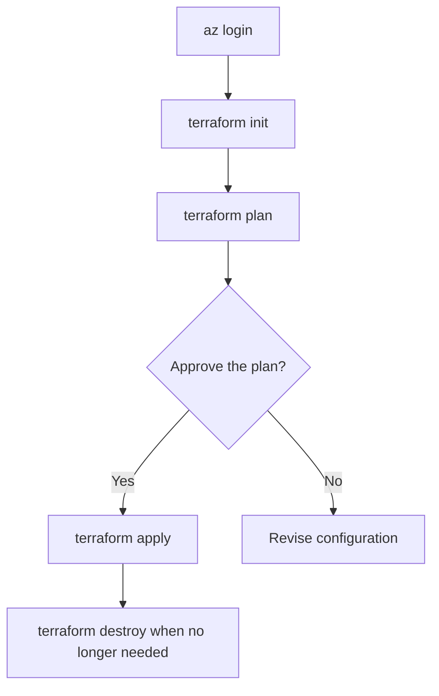

# Azure Infrastructure with Terraform

> This approach focuses on `setting up the required infrastructure via Terraform`. It allows for source control of not only the solution code, connections, and setups `but also the infrastructure itself`.


## Prerequisites

- An `Azure subscription is required`. All other resources, including instructions for creating a Resource Group, are provided in this workshop.
- `Contributor role assigned or any custom role that allows`: access to manage all resources, and the ability to deploy resources within subscription.
- Please ensure that:
  - [Terraform is installed on your local machine](https://developer.hashicorp.com/terraform/tutorials/azure-get-started/install-cli#install-terraform).
  - [Install the Azure CLI](https://learn.microsoft.com/en-us/cli/azure/install-azure-cli) to work with both Terraform and Azure commands.

## Overview

Templates structure:

```
.
├── README.md
├────── main.tf
├────── variables.tf
├────── provider.tf
├────── terraform.tfvars
├────── outputs.tf
```

- main.tf `(Main Terraform configuration file)`: This file contains the core infrastructure code. It defines the resources you want to create, such as virtual machines, networks, and storage. It's the primary file where you describe your infrastructure in a declarative manner.
- variables.tf `(Variable definitions)`: This file is used to define variables that can be used throughout your Terraform configuration. By using variables, you can make your configuration more flexible and reusable. For example, you can define variables for resource names, sizes, and other parameters that might change between environments.
- provider.tf `(Provider configurations)`: Providers are plugins that Terraform uses to interact with cloud providers, SaaS providers, and other APIs. This file specifies which providers (e.g., AWS, Azure, Google Cloud) you are using and any necessary configuration for them, such as authentication details.
- terraform.tfvars `(Variable values)`: This file contains the actual values for the variables defined in `variables.tf`. By separating variable definitions and values, you can easily switch between different sets of values for different environments (e.g., development, staging, production) without changing the main configuration files.
- outputs.tf `(Output values)`: This file defines the output values that Terraform should return after applying the configuration. Outputs are useful for displaying information about the resources created, such as IP addresses, resource IDs, and other important details. They can also be used as inputs for other Terraform configurations or scripts.

## Finding `principal_id` Using Azure CLI

> The `principal_id` is typically the Object ID of a user, group, or service principal in Azure Entra ID (former AAD). You can find this ID in the Azure portal or by using the Azure CLI.

Get the Object ID of list of Users:

```sh
az ad user list --query "[].{Name:displayName, ObjectId:id, Email:userPrincipalName}" --output table
```


Here is an example value for `admin_principal_id` which is Object ID you retrieved.

```hcl
admin_principal_id = "12345678-1234-1234-1234-1234567890ab"
```

## Deploy with Terraform



<div class="admonition important" markdown="1">
<p class="admonition-title">Important</p>

Update `terraform.tfvars` with your environment values before running this workflow. Review the generated plan before applying or destroying infrastructure.

</div>

1. **Login to Azure**: This command logs you into your Azure account. It opens a browser window where you can enter your Azure credentials. Once logged in, you can manage your Azure resources from the command line.

    > Go to the path where Terraform files are located:

    ```sh
    cd terraform-infrastructure
    ```
    
    ```sh
    az login
    ```

    

    

2. **Initialize Terraform**: Initializes the working directory containing the Terraform configuration files. It downloads the necessary provider plugins and sets up the backend for storing the state.

    ```sh
    terraform init
    ```

   

### Review the Plan

Create an execution plan to review the changes Terraform will make using the values in `terraform.tfvars`.

```sh
terraform plan -var-file terraform.tfvars
```


### Apply the Configuration

Apply the reviewed plan. Terraform prompts for confirmation before creating or updating resources.

```sh
terraform apply -var-file terraform.tfvars
```


### Remove the Infrastructure

Destroy the managed infrastructure when it is no longer needed. Review the deletion plan carefully before confirming.

```sh
terraform destroy -var-file terraform.tfvars
```


[Back to the embedding model guide](https://cloud2br-msftlearninghub.github.io/Azure-Text-Embedding-Overview/)
